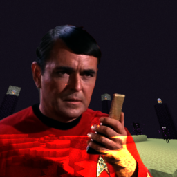

<h1 align="center">
  
   
  Unbeam me up, Scotty!
</h1>

  <!-- GITHUB DOWNLOADS --->
  
  <!-- GITHUB STARS --->
  
  <!-- LICENSE --->
  

**Unbeam Me Up** is a simple client-side [Fabric][fabric] mod made for **Quacon SMP** that removes the light show emitted by ender dragons during their death sequence. This significantly reduces FPS/client lag with death-suppressed dragon experience farms.
***

### Getting Started
- Make sure you're running a Fabric instance of the game. If you're playing from the vanilla launcher, follow the [Fabric installation guide][fabric-guide]. If you're playing from a third-party launcher like [Prism][prism], you'll need to follow their own instructions which you can often find on their respective websites. For example, [here][prism-guide] is Prism's guide to downloading mods.
- Download the latest version of **Unbeam Me Up** for your game version from the [GitHub releases][github-releases] page. Drag the `.jar` file into your mods folder and launch the game!

[fabric]: https://fabricmc.net
[fabric-installer]: https://fabricmc.net/use/installer
[fabric-guide]: https://docs.fabricmc.net/players/installing-fabric
[prism]: https://prismlauncher.org
[prism-guide]: https://prismlauncher.org/wiki/getting-started/download-mods
[github-releases]: https://github.com/axialeaa/UnbeamMeUp/releases
